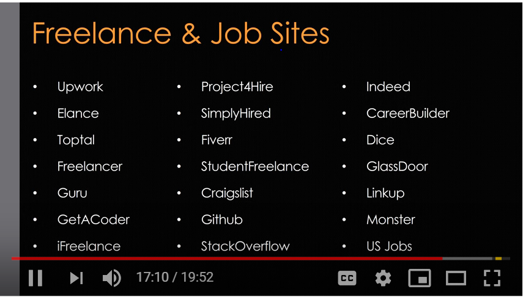

# Freelancing as a Web Developer

* <https://www.youtube.com/watch?v=m2N3tmJ_A0Q&feature=youtu.be>
* Humanitarian Toolbox: <http://www.htbox.org/>
* <https://insights.dice.com/2018/01/19/freelancing-or-office-work/>
* <https://www.linkedin.com/pulse/whats-like-working-contractor-thru-staffing-agency-judi-wunderlich/>
* Business mentoring for entrepreneurs: <https://www.micromentor.org/>
* Business mentoring for entrepeneurs: <https://www.score.org/>
* <https://drive.google.com/file/d/1djG8GctEGyhhibV_7OwLfujtsS1vll8R/view>

## Pros of Freelancing

* Freedom & Flexibility
* Work from home or anywhere
* Make your own hours
* Pick and choose projects
* Work alone (could be a pro or a con)

## Cons of Freelancing

* Unpredictability
* No Benefits - Health insurance, Retirement, etc.
* Lack of Community
* Motivational Issues
* Separation of work and home

## Freelancing is not for everyone

* Trouble with motivation, passion and energy
* Trouble managing your time
* Easily distracted
* Trouble dealing with clients
* Hate being alone
* You do not like to learn

## Before you start

* Learn as much as you can
* Decide your main focus when it comes to services/tech
* Create your business plan & document (pricing, contract invoices, meet with an accountant if possibe)
* Build your website and brand (if possible, include some kind of portfolio)

## Where and how to find work

* Freelance and job sites (list coming up)
* Online/social networking
* Real Life Networking
* Advertising - online and local
* Online Content

## Freelance and job sites

## Be confident

* you won't be an expert when you first start out.
* you will build your skill and confidence with each project.
* as long as you know the project is not impossible, take it on. Even if there are certain things you do not know, you can figure it out.
* give your client a realistic timeline.
